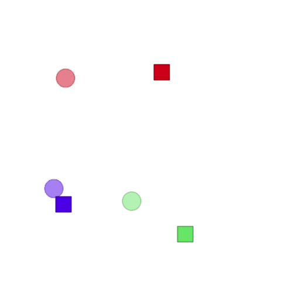

# MULTI AGENT PARTICLE ENV

## About
Multiagent particle environment to support both discrete and continuous actions

Reference links:
[openai-repo](https://github.com/openai/multiagent-particle-envs),  [openai-repo-forked](https://github.com/shariqiqbal2810/multiagent-particle-envs)


## KNOWN REQUIREMENTS
- Python
- NumPy
- Openai Gym (v0.7.3 is adviced for compatibility purposes)
 

## SETUP EXAMPLE

Create virtual environment and activate it
```
$ conda create --name WMG_DS_MADRL_py369 python=3.6.9
$ conda activate WMG_DS_MADRL_py369
```
Install Gym
```
$ pip install gym==0.7.3
```
 
Test installation with ```example_test_enviroment.py``` which contains a created skeleton to run a uniform random policy on a selected scenario (``simple_spread`` by default).
```
$ python example_test_enviroment.py`
```
Run scenarios in interactive mode:
```
$ python bin/interactive.py
```

## Drones targetting scenarios
Scenario: drones_targets_a3.py



- Circles represent agents
- Squares represent landmarks
- Colors indicate pairs assignments; the task of each agent is to reach the landmark which has the same color; 

## Contributors
Emanuele Pesce
